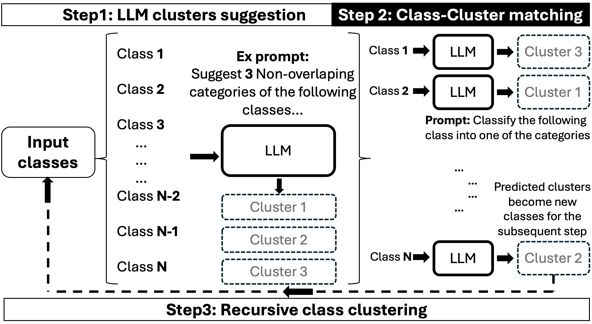

# Geospatial Image Labeling Tool (GeoVision Labeler)

This repository contains a flexible image labeling tool that takes any image as input and generates a classification label from a set of user-provided classes. It uses a vision LLM from Hugging Face (e.g. `microsoft/kosmos-2-patch14-224`) to generate a detailed description of the image, and then uses one of the classification options:

- **OpenAI Classification:** Uses the OpenAI models such as GPT-4 or GPT-3.5 via either the Azure OpenAI API or the OpenAI API.
- **Open-Source Classification:** Uses a Hugging Face language model (e.g. Llama 3.2) via a text-generation pipeline.
- **CLIP Classification (Fallback):** By default, the CLIP model is used as a fallback when the primary pipeline (vision LLM + Classifier) fails to generate a valid label (i.e., a label not included in the list of classes). In such cases, the CLIP model selects the most likely class from the provided list. The CLIP model can also be used as a standalone classifier. 


*The satellite image is derived from the [SpaceNet v7 dataset](https://spacenet.ai/sn7-challenge/).*

To handle a large set of semantically related labels (e.g., the 21 [UC Merced](http://weegee.vision.ucmerced.edu/datasets/landuse.html) land-use categories) more effectively, it can be beneficial to first organize them into a smaller set of *meta-classes* before classification. We introduced a zero-shot, LLM-driven semantic clustering pipeline that merges similar classes into meta-classes recursively (in a hierarchical way). The pipeline operates in three steps as follows:



This process will generate a YAML file that captures the hierarchical structure of the meta-classes. These meta-classes are then leveraged to perform hierarchical classification.

Ex of meta-classes generated for [UC Merced](http://weegee.vision.ucmerced.edu/datasets/landuse.html):
#### Natural Landscapes
- Agricultural
- Beach
- Chaparral
- Forest
- River

#### Recreational Areas
- Baseball Diamond
- Golf Course
- Tennis Court
...


## Features

- **Modular Design:** Separated image description and classification modules.
- **Flexible Configuration:** Choose the classifier method (OpenAI vs. open-source) and API variant (Azure OpenAI vs. OpenAI) via command-line arguments.
- **Output:** Results (filenames, predicted labels, and metadata information such as region/patch boundaries and descriptions) are saved in a CSV file.
- **Recursive Class Clustering & Hierarchical Classification:** Automatically groups semantically similar classes into meta-classes using a zero-shot, LLM-driven clustering pipeline. This enables hierarchical classification, improving accuracy of meta-classes when dealing with large or complex label sets.
- **Easy to Extend:** The code is designed so that new models or processing options can be added with minimal changes.

## Installation

1. **Clone the Repository:**

   ```bash
   git clone https://github.com/microsoft/geo-vision-labeler.git
   cd geo-vision-labeler
    ```

2. **Create a Conda Environment File (environment.yml) (optional but recommended):**

    ```bash
        conda env create -f environment.yml
        conda activate geo_vision_labeler
    ```
## Repository Structure
```plaintext
.
├── README.md
├── environment.yml
├── setup.py
├── data
│   ├── classes.txt  # File containing classification labels (one label per line):
│   │                 # Buildings
│   └──               # No Buildings
├── src
│   ├── __init__.py
│   ├── main.py
│   ├── cluster.py
│   ├── vision.py
│   ├── classifier.py
│   ├── clip.py
│   └── display_chunks.py
```

## Configuration

Set up your API keys as environment variables. For example:

**For Hugging Face:**

```bash
export HF_TOKEN='your-hugging-face-token'
```

**For Azure OpenAI:**

```bash
    export AZURE_OPENAI_API_KEY='your-azure-openai-api-key'
    export AZURE_OPENAI_ENDPOINT='your-azure-openai-endpoint'
    export AZURE_OPENAI_API_VERSION='your-api-version'
```

**For OpenAI API:**

```bash
    export OPENAI_API_KEY='your-openai-api-key'
```

Other settings (such as the input directory, prompt, and device) can be passed via command-line arguments `src/main.py`.

## Usage

Run the tool from the command line. For example:

**Using Hugging Face Models as Classifiers:**

```bash
python src/main.py --input_dir path/to/images --output_file path/to/labels.csv --vision_model vision-model-name-from-hugging-face --classifier llm-classifier-name-from-hugging-face --classes_file path/to/classes.txt --classifier_type huggingface --split_height_by split-height-by --split_width_by split-width-by --context "This is a satellite image" --prompt "Detailed long description of the image: " --include_filename
```

**Using OpenAI Models as Classifiers:**

```bash
python src/main.py --input_dir path/to/images --output_file path/to/labels.csv --vision_model vision-model-name-from-hugging-face --classifier llm-classifier-name-from-openai --classes_file path/to/classes.txt --classifier_type openai --openai_variant azure --split_height_by split-height-by --split_width_by split-width-by --context "This is a satellite image" --prompt "Detailed long description of the image: " --include_filename
```

**Using CLIP Models from Hugging Face:**

```bash
python src/main.py --input_dir path/to/images --output_file path/to/labels.csv --classes_file path/to/classes.txt --classifier clip-classifier-name-from-hugging-face --classifier_type clip --split_height_by split-height-by --split_width_by split-width-by --context "This is a satellite image"
```

An example of a CLIP model is `openai/clip-vit-large-patch14`. 

### Command-line Options for `main.py`:
- `--input_dir`: (Required) Directory containing input images.
- `--output_file`: CSV file to write the results. Defaults to `data/labels.csv`.
- `--mode`: Classification mode. Choose between `"flat"` (single-level classification) or `"hierarchical"` (multi-level classification using meta-classes). Defaults to `"flat"`.
- `--classes_file`: File containing the classes for classification. For flat classification (`--mode flat`), provide a `.txt` file with one class per line (default: `data/classes.txt`). For hierarchical classification (`--mode hierarchical`), provide a `.yaml` file describing the meta-class hierarchy. The YAML file can be automatically generated using the `src/cluster.py` script.
- `--vision_model`: Vision model to use for image description. Defaults to `microsoft/kosmos-2-patch14-224`.
- `--apply_vision_template`: Use the 'role'/'content' prompt template for the vision model. This flag is required when using Llama vision models.
- `--classifier`: Name of the classifier model. Defaults to `microsoft/Phi-3-mini-4k-instruct`.
- `--classifier_type`: Classifier type: OpenAI LLMs (`openai`), Hugging Face LLMs (`huggingface`), or CLIP models (`clip`). Defaults to `huggingface`.
- `--openai_variant`: For OpenAI classifier, choose Azure OpenAI (`azure`) or OpenAI (`openai`) API. Defaults to `azure`. Only valid when `classifier_type` is `openai`.
- `--split_height_by`: Number of vertical splits per image. Defaults to `1`.
- `--split_width_by`: Number of horizontal splits per image. Defaults to `1`.
- `--context`: Meta prompt to guide the vision model. Defaults to `"This is a satellite image. "`.
- `--prompt`: Prompt to guide the vision model. Defaults to `"Detailed long description of the image: "`.
    This is particularly useful when the filename contains contextual information, 
    such as geographical details, that can enhance the model's understanding. Use this flag to enable.
- `--include_classes`: Include the list of classes in the prompt of the vision model. Use this flag to enable.
- `--include_filename`: Include the filename in the prompt of the vision model. Use this flag to enable.
- `--test_time_augmentation`: Test time augmentation strategies for rotation with x, y, and/or both axes `[x, y, xy]`.
- `--device`: Device to run the Hugging Face models on. Defaults to `cuda:0` if available, otherwise `cpu`.

### Generating Meta-Classes for Hierarchical Classification

To automatically generate meta-classes for hierarchical classification, use the `src/cluster.py` script. This script clusters your class labels into meta-classes using an LLM (OpenAI or Hugging Face) in one or more recursive steps.

**Basic usage:**

```bash
python src/cluster.py --classes_file path/to/classes.txt --num_clusters number-of-clusters --steps recursive-steps-or-hierarchical-depth --clustering_type huggingface --model_name your-hf-model-name --output_file clusters.yaml
```

**Key arguments:**
- `--classes_file`: Path to your `.txt` file containing class labels (one per line).
- `--steps`: Number of recursive clustering steps (default: 1). If greater than 1, `--num_clusters` should be a list matching the number of steps.
- `--num_clusters`: Number of clusters (meta-classes) to create at each step. For multi-step clustering, you can provide either a single number (which will be used for all steps), or a comma-separated list where the number of elements matches the number of steps (e.g., `3,5` when `steps=2`). If a single value is given for multiple steps, it will be applied to each step.
- `--clustering_type`: Choose `"openai"` or `"huggingface"` for the LLM backend.
- `--openai_variant`: (If using `openai`) Choose `"azure"` or `"openai"` API (default: `"azure"`).
- `--model_name`: (Optional) Specify the LLM model name.
- `--output_file`: Output YAML file for the generated meta-class hierarchy (default: `clusters.yaml`).

**Example for two-step clustering:**

```bash
python src/cluster.py --classes_file data/classes.txt --num_clusters 3,5 --steps 2 --clustering_type openai --openai_variant openai --output_file data/meta_classes.yaml
```

The resulting YAML file can be used as input for hierarchical classification by passing it to the `--classes_file` argument in `main.py` with `--mode hierarchical`.

### Example Usage

This section provides an example of how to run the GeoVision Labeler tool and explains the structure of the output CSV file containing the generated labels. The CSV file includes detailed descriptions and classifications for each region/patch of the input image, divided into a grid based on the specified split dimensions. Each row in the file corresponds to a specific region/patch, with metadata such as its position, boundaries, description, and classification label.
To run this example, you can download satellite images from the [SpaceNet v7 dataset](https://spacenet.ai/sn7-challenge/). Once downloaded, place the images in the `data/images` directory and ensure the `classes.txt` file contains the classification labels `Buildings` and `No Buildings`. Then run: 

```bash
python src/main.py --input_dir data/images --output_file data/labels.csv --split_height_by 3 --split_width_by 3 --include_filename
```

#### Visualizing Labeled Results on Images

To overlay the labeled results directly onto a given image, use the `display_chunks.py` script. For example:

```bash
python src/display_chunks.py --labels_path data/labels.csv --img_path data/images/2020_01_L15-0566E-1185N.tif --output_path data/outputs/2020_01_L15-0566E-1185N_3x3.png
```


### Performance Results

We evaluated the GeoVision Labeler on 59 scenes from the [SpaceNet v7 dataset](https://spacenet.ai/sn7-challenge/), using the example usage configuration. Each image was divided into 9 patches. Based on the SpaceNet v7 ground truth labels, each patch was assigned a label of "Buildings" if at least one pixel from the patch was labeled as a building, or "No Buildings" otherwise. Since the dataset is temporal, we randomly selected a timestamp for each scene. The list of selected scenes and their corresponding periods can be found in `data/spacenet_eval.csv`. Predictions were then performed using the GeoVision Labeler pipeline, and the results were compared against the ground truth to compute the evaluation metrics.

The following metrics were computed to assess the pipeline's performance:


<p><strong>Table:</strong> Overall Accuracy (OA) for SpaceNet v7 satellite image patches from 59 scenes, each divided into 9 patches labeled as <em>Buildings</em> or <em>No Buildings</em>. Best OA scores for each classifier and vision model from GeoVision Labeler (GVL) are in <strong>bold</strong>. The <strong>Classes</strong> column indicates whether the list of classes is inserted into the vLLM’s prompt. <strong>Other</strong> refers to vision models used standalone.</p>

<details>
  <summary>Click to view detailed SpaceNet v7 evaluation results</summary>
  <div style="text-align: center;">
  <table border="1" cellspacing="0" cellpadding="6">
  <thead>
    <tr>
      <th rowspan="2">Pipeline</th>
      <th rowspan="2">Classifier</th>
      <th rowspan="2" style="text-align:center">Classes</th>
      <th rowspan="2" style="text-align:center">Geo-context</th>
      <th colspan="3" style="text-align:center">Vision Model</th>
    </tr>
    <tr>
      <th style="text-align:center">Other</th>
      <th style="text-align:center">Kosmos 2</th>
      <th style="text-align:center">Llama 3.2</th>
    </tr>
  </thead>
  <tbody>
    <tr>
      <td>CLIP</td>
      <td style="text-align:center">–</td>
      <td style="text-align:center">–</td>
      <td style="text-align:center">–</td>
      <td style="text-align:center">0.588</td>
      <td style="text-align:center">–</td>
      <td style="text-align:center">–</td>
    </tr>
    <tr>
      <td rowspan="12" style="vertical-align:middle; text-align:center;"><strong>GVL (Ours)</strong></td>
      <td rowspan="2">Llama-3.1</td>
      <td rowspan="2" style="text-align:center">✓</td>
      <td style="text-align:center">×</td>
      <td style="text-align:center">–</td>
      <td style="text-align:center">0.859</td>
      <td style="text-align:center">0.776</td>
    </tr>
    <tr>
      <td style="text-align:center">✓</td>
      <td style="text-align:center">–</td>
      <td style="text-align:center"><strong>0.910</strong></td>
      <td style="text-align:center">0.699</td>
    </tr>
    <tr>
      <td rowspan="2">Llama-3.1</td>
      <td rowspan="2" style="text-align:center">×</td>
      <td style="text-align:center">×</td>
      <td style="text-align:center">–</td>
      <td style="text-align:center">0.889</td>
      <td style="text-align:center"><strong>0.821</strong></td>
    </tr>
    <tr>
      <td style="text-align:center">✓</td>
      <td style="text-align:center">–</td>
      <td style="text-align:center">0.859</td>
      <td style="text-align:center">0.751</td>
    </tr>
    <tr>
      <td rowspan="2">Phi-3</td>
      <td rowspan="2" style="text-align:center">✓</td>
      <td style="text-align:center">×</td>
      <td style="text-align:center">–</td>
      <td style="text-align:center"><strong>0.932</strong></td>
      <td style="text-align:center">0.857</td>
    </tr>
    <tr>
      <td style="text-align:center">✓</td>
      <td style="text-align:center">–</td>
      <td style="text-align:center">0.928</td>
      <td style="text-align:center">0.902</td>
    </tr>
    <tr>
      <td rowspan="2">Phi-3</td>
      <td rowspan="2" style="text-align:center">×</td>
      <td style="text-align:center">×</td>
      <td style="text-align:center">–</td>
      <td style="text-align:center">0.928</td>
      <td style="text-align:center">0.912</td>
    </tr>
    <tr>
      <td style="text-align:center">✓</td>
      <td style="text-align:center">–</td>
      <td style="text-align:center"><strong>0.932</strong></td>
      <td style="text-align:center"><strong>0.927</strong></td>
    </tr>
    <tr>
      <td rowspan="2">GPT-4o</td>
      <td rowspan="2" style="text-align:center">✓</td>
      <td style="text-align:center">×</td>
      <td style="text-align:center">–</td>
      <td style="text-align:center">0.878</td>
      <td style="text-align:center">0.789</td>
    </tr>
    <tr>
      <td style="text-align:center">✓</td>
      <td style="text-align:center">–</td>
      <td style="text-align:center"><strong>0.917</strong></td>
      <td style="text-align:center">0.799</td>
    </tr>
    <tr>
      <td rowspan="2">GPT-4o</td>
      <td rowspan="2" style="text-align:center">×</td>
      <td style="text-align:center">×</td>
      <td style="text-align:center">–</td>
      <td style="text-align:center">0.896</td>
      <td style="text-align:center"><strong>0.832</strong></td>
    </tr>
    <tr>
      <td style="text-align:center">✓</td>
      <td style="text-align:center">–</td>
      <td style="text-align:center">0.876</td>
      <td style="text-align:center">0.783</td>
    </tr>
  </tbody>
</table>
</div>
</details>


**Model Names on Hugging Face**

- ***Vision Models:***
    - Kosmos 2 ([microsoft/kosmos-2-patch14-224](https://huggingface.co/microsoft/kosmos-2-patch14-224))
    - Llama 3.2 ([meta-llama/Llama-3.2-11B-Vision-Instruct](https://huggingface.co/meta-llama/Llama-3.2-11B-Vision-Instruct))
    - CLIP ([openai/clip-vit-large-patch14](https://huggingface.co/openai/clip-vit-large-patch14))
- ***LLM Classifiers:***
    - Llama 3.1 ([meta-llama/Llama-3.1-8B-Instruct](https://huggingface.co/meta-llama/Llama-3.1-8B-Instruct))
    - Phi-3 ([microsoft/Phi-3-mini-4k-instruct](https://huggingface.co/microsoft/Phi-3-mini-4k-instruct))

These results demonstrate the effectiveness of the tool in generating accurate classifications for geospatial imagery, though performance may vary depending on the specific dataset and pipeline configuration.

## Limitations

- **Model Dependency:** The quality of the generated descriptions and classifications depends heavily on the selected vision and language models. Suboptimal models may lead to inaccurate results.
- **Class Confusion:** When dealing with a large number of classes, especially those that are similar, the model may confuse related classes with each other. Hierarchical classification using meta-classes helps to distinguish broader categories, but confusion still occur among classes within the same meta-class.
- **Latency:** Hierarchical classification introduces additional computational steps, which can increase the overall latency of the labeling process compared to flat classification.
- **Image Patch Size:** Early experiments show that small image patches (e.g., smaller than 224x224) may not contain enough contextual information for this pipeline to work effectively. Conversely, very large patches might reduce the pipeline's ability to focus on important details during the description stage, potentially hindering the classifier's performance.
- **Image Resolution:**  Very high-resolution images may need to be split into smaller chunks, which could lead to loss of context for certain regions/patches and slow down the pipeline.
- **Image Variability:** The tool may struggle with images containing unusual environmental conditions, especially as most vision LLMs are not trained on satellite images.
- **Image Format Restriction:** The tool is designed to work with RGB images, as expected by most vision LLM models. However, satellite images often contain additional spectral bands (e.g., near-infrared) that could provide more accurate descriptions but are not utilized in the current implementation. Using vision LLMs specifically designed to handle satellite images with spectral bands beyond RGB can address this limitation.

Users should consider these limitations when deploying the tool in production environments.

## Citation

If you use GeoVision Labeler in your research or project, please cite our work as follows:

```bibtex
@article{hacheme2025geovision,
  title={GeoVision Labeler: Zero-Shot Geospatial Classification with Vision and Language Models},
  author={Hacheme, Gilles Quentin and Tadesse, Girmaw Abebe and Robinson, Caleb and Zaytar, Akram and Dodhia, Rahul and Lavista Ferres, Juan M.},
  journal={arXiv preprint arXiv:2505.24340},
  year={2025}
}
```

This project welcomes contributions and suggestions.  Most contributions require you to agree to a Contributor License Agreement (CLA) declaring that you have the right to, and actually do, grant us the rights to use your contribution. For details, visit https://cla.opensource.microsoft.com.

When you submit a pull request, a CLA bot will automatically determine whether you need to provide a CLA and decorate the PR appropriately (e.g., status check, comment). Simply follow the instructions provided by the bot. You will only need to do this once across all repos using our CLA.

This project has adopted the [Microsoft Open Source Code of Conduct](https://opensource.microsoft.com/codeofconduct/).
For more information see the [Code of Conduct FAQ](https://opensource.microsoft.com/codeofconduct/faq/) or contact [opencode@microsoft.com](mailto:opencode@microsoft.com) with any additional questions or comments.

## Trademarks

This project may contain trademarks or logos for projects, products, or services. Authorized use of Microsoft trademarks or logos is subject to and must follow [Microsoft's Trademark & Brand Guidelines](https://www.microsoft.com/en-us/legal/intellectualproperty/trademarks/usage/general).
Use of Microsoft trademarks or logos in modified versions of this project must not cause confusion or imply Microsoft sponsorship.
Any use of third-party trademarks or logos are subject to those third-party's policies.

## License

This project is licensed under the [MIT License](LICENSE).
