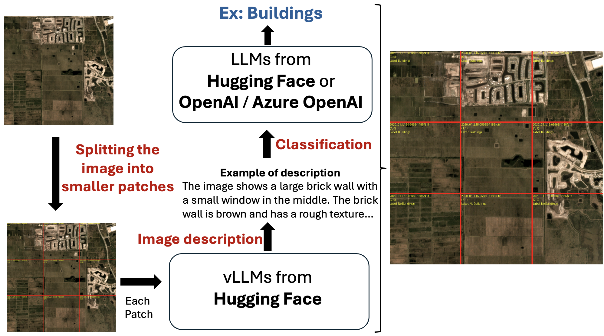

# Geospatial Image Labeling Tool (GeoVision Labeler)

This repository contains a flexible image labeling tool that takes any image as input and generates a classification label from a set of user-provided classes. It uses a vision LLM from Hugging Face (e.g. `microsoft/kosmos-2-patch14-224`) to generate a detailed description of the image, and then uses one of two classification options:

- **OpenAI Classification:** Uses the OpenAI models such as GPT-4 or GPT-3.5 via either the Azure OpenAI API or the OpenAI API.
- **Open-Source Classification:** Uses a Hugging Face language model (e.g. Llama 3.2) via a text-generation pipeline.



*The satellite image is derived from the [SpaceNet v7 dataset](https://spacenet.ai/sn7-challenge/).*

## Features

- **Modular Design:** Separated image description and classification modules.
- **Flexible Configuration:** Choose the classifier method (OpenAI vs. open-source) and API variant (Azure OpenAI vs. OpenAI) via command-line arguments.
- **Output:** Results (filenames, predicted labels, and metadata information such as region/patch boundaries and descriptions) are saved in a CSV file.
- **Easy to Extend:** The code is designed so that new models or processing options can be added with minimal changes.

## Installation

1. **Clone the Repository:**

   ```bash
   git clone https://github.com/microsoft/geo-vision-labeler.git
   cd geo-vision-labeler
    ```

2. **Create a Conda Environment File (environment.yml) (optional but recommended):**

    ```bash
        conda env create -f environment.yml
        conda activate geo_vision_labeler
    ```
## Repository Structure
```plaintext
.
├── README.md
├── environment.yml
├── setup.py
├── data
│   ├── classes.txt  # File containing classification labels (one label per line):
│   │                 # Buildings
│   └──               # No Buildings
├── src
│   ├── __init__.py
│   ├── main.py
│   ├── vision.py
│   ├── classifier.py
│   └── display_chunks.py
```

## Configuration

Set up your API keys as environment variables. For example:

**For Azure OpenAI:**

```bash
    export AZURE_OPENAI_API_KEY='your-azure-openai-api-key'
    export AZURE_OPENAI_ENDPOINT='your-azure-openai-endpoint'
    export AZURE_OPENAI_API_VERSION='your-api-version'
```

**For OpenAI API:**

```bash
    export OPENAI_API_KEY='your-openai-api-key'
```

Other settings (such as the input directory, prompt, and device) can be passed via command-line arguments `src/main.py`.

## Usage

Run the tool from the command line. For example:


**Using Hugging Face Models:**

```bash
python src/main.py --input_dir path/to/images --output_file path/to/labels.csv --vision_model vision-model-name-from-hugging-face --classifier llm-classifier-name-from-hugging-face --classes_file path/to/classes.txt --classifier_type huggingface-or-openai --split_height_by split-height-by --split_width_by split-width-by --context "This is a satellite image" --prompt "Detailed long description of the image: " --include_filename
```

**Using OpenAI Models:**

```bash
python src/main.py --input_dir path/to/images --output_file path/to/labels.csv --vision_model vision-model-name-from-hugging-face --classifier llm-classifier-name-from-openai --classes_file path/to/classes.txt --classifier_type openai --openai_variant azure --split_height_by split-height-by --split_width_by split-width-by --context "This is a satellite image" --prompt "Detailed long description of the image: " --include_filename
```

### Command-line Options:
- `--input_dir`: (Required) Directory containing input images.
- `--output_file`: CSV file to write the results. Defaults to `data/labels.csv`.
- `--classes_file`: File containing the classes for classification. Defaults to `data/classes.txt`.
- `--vision_model`: Vision model to use for image description. Defaults to `microsoft/kosmos-2-patch14-224`.
- `--classifier`: Name of the classifier model. Defaults to `meta-llama/Llama-3.1-8B-Instruct`.
- `--classifier_type`: Classifier type: OpenAI (`openai`) or Hugging Face (`huggingface`). Defaults to `huggingface`.
- `--openai_variant`: For OpenAI classifier, choose Azure OpenAI (`azure`) or OpenAI (`openai`) API. Defaults to `azure`. Only valid when `classifier_type` is `openai`.
- `--split_height_by`: Number of vertical splits per image. Defaults to `1`.
- `--split_width_by`: Number of horizontal splits per image. Defaults to `1`.
- `--context`: Meta prompt to guide the vision model. Defaults to `"This is a satellite image. "`.
- `--prompt`: Prompt to guide the vision model. Defaults to `"Detailed long description of the image: "`.
- `--include_filename`: Include the filename in the prompt for the vision model. Use this flag to enable.
- `--test_time_augmentation`: Test time augmentation strategies for rotation with x, y, and/or both axes `[x, y, xy]`.
- `--device`: Device to run the Hugging Face models on. Defaults to `cuda:0` if available, otherwise `cpu`.

### Example Usage

This section provides an example of how to run the GeoVision Labeler tool and explains the structure of the output CSV file containing the generated labels. The CSV file includes detailed descriptions and classifications for each region/patch of the input image, divided into a grid based on the specified split dimensions. Each row in the file corresponds to a specific region/patch, with metadata such as its position, boundaries, description, and classification label.
To run this example, you can download satellite images from the [SpaceNet v7 dataset](https://spacenet.ai/sn7-challenge/). Once downloaded, place the images in the `data/images` directory and ensure the `classes.txt` file contains the classification labels `Buildings` and `No Buildings`. Then run: 

```bash
python src/main.py --input_dir data/images --output_file data/labels.csv --vision_model microsoft/kosmos-2-patch14-224 --classifier meta-llama/Llama-3.1-8B-Instruct --classes_file data/classes.txt  --classifier_type huggingface --split_height_by 3 --split_width_by 3 --context "This is a satellite image" --prompt "Detailed long description of the image: " --include_filename
```

#### Visualizing Labeled Results on Images

To overlay the labeled results directly onto a given image, use the `display_chunks.py` script. For example:

```bash
python src/display_chunks.py --labels_file data/labels.csv --images_dir data/images --filename 2020_01_L15-0566E-1185N.tif --output_file data/outputs/2020_01_L15-0566E-1185N_3x3.png
```

### Model Performance Results

We evaluated the GeoVision Labeler on 59 scenes from the [SpaceNet v7 dataset](https://spacenet.ai/sn7-challenge/), using the example usage configuration. Each image was divided into 9 patches. Based on the SpaceNet v7 ground truth labels, each patch was assigned a label of "Buildings" if at least one pixel from the patch was labeled as a building, or "No Buildings" otherwise. Since the dataset is temporal, we randomly selected a timestamp for each scene. The list of selected scenes and their corresponding periods can be found in `data/spacenet_eval.csv`. Predictions were then performed using the GeoVision Labeler pipeline, and the results were compared against the ground truth to compute the evaluation metrics.

The following metrics were computed to assess the pipeline's performance:

| Metric     | Llama3.1 | GPT-4o |
|------------|:--------:|:------:|
| Precision  |   0.91   |  0.91  |
| Recall     |   0.87   |  0.90  |
| F1-score   |   0.89   |  0.90  |

These results demonstrate the effectiveness of the tool in generating accurate classifications for geospatial imagery, though performance may vary depending on the specific dataset and model configuration.

## Limitations

- **Model Dependency:** The quality of the generated descriptions and classifications depends heavily on the selected vision and language models. Suboptimal models may lead to inaccurate results.
- **Image Resolution:** Very high-resolution images may need to be split into smaller chunks, which could lead to loss of context for certain regions/patches and slow down the pipeline.
- **Image Variability:** The tool may struggle with images containing unusual environmental conditions, especially as most vision LLMs are not trained on satellite images.
- **Image Format Restriction:** The tool is designed to work with RGB images, as expected by most vision LLM models. However, satellite images often contain additional spectral bands (e.g., near-infrared) that could provide more accurate descriptions but are not utilized in the current implementation. Using vision LLMs specifically designed to handle satellite images with spectral bands beyond RGB can address this limitation.

Users should consider these limitations when deploying the tool in production environments.

## Contributing

This project welcomes contributions and suggestions.  Most contributions require you to agree to a
Contributor License Agreement (CLA) declaring that you have the right to, and actually do, grant us
the rights to use your contribution. For details, visit https://cla.opensource.microsoft.com.

When you submit a pull request, a CLA bot will automatically determine whether you need to provide
a CLA and decorate the PR appropriately (e.g., status check, comment). Simply follow the instructions
provided by the bot. You will only need to do this once across all repos using our CLA.

This project has adopted the [Microsoft Open Source Code of Conduct](https://opensource.microsoft.com/codeofconduct/).
For more information see the [Code of Conduct FAQ](https://opensource.microsoft.com/codeofconduct/faq/) or
contact [opencode@microsoft.com](mailto:opencode@microsoft.com) with any additional questions or comments.

## Trademarks

This project may contain trademarks or logos for projects, products, or services. Authorized use of Microsoft 
trademarks or logos is subject to and must follow 
[Microsoft's Trademark & Brand Guidelines](https://www.microsoft.com/en-us/legal/intellectualproperty/trademarks/usage/general).
Use of Microsoft trademarks or logos in modified versions of this project must not cause confusion or imply Microsoft sponsorship.
Any use of third-party trademarks or logos are subject to those third-party's policies.

## License

This project is licensed under the [MIT License](LICENSE).
